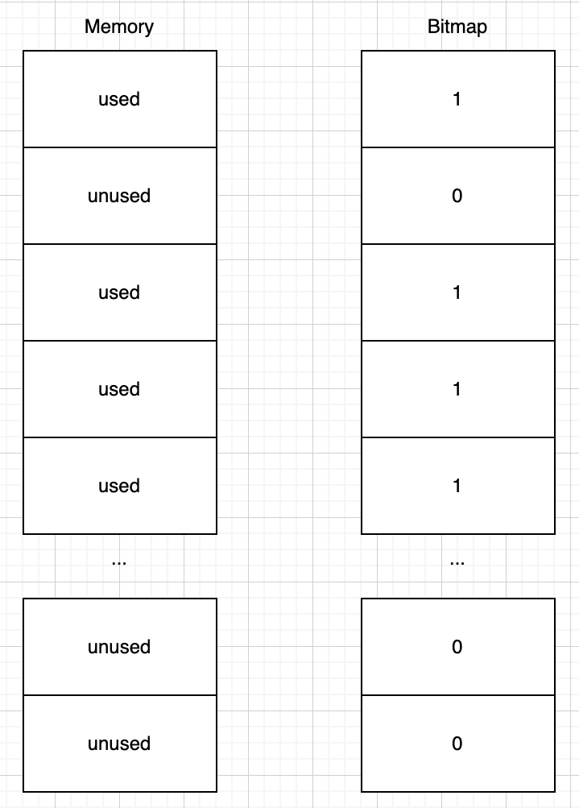
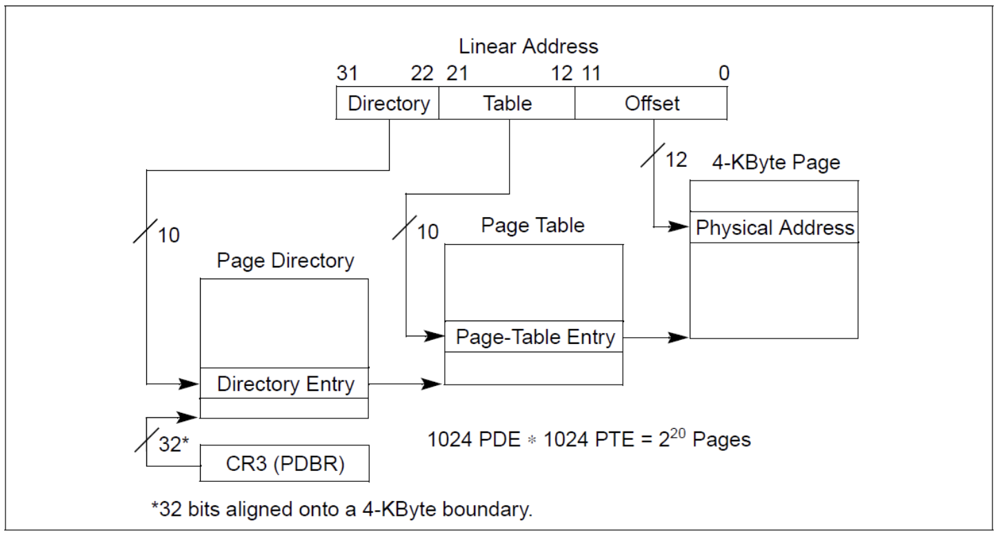
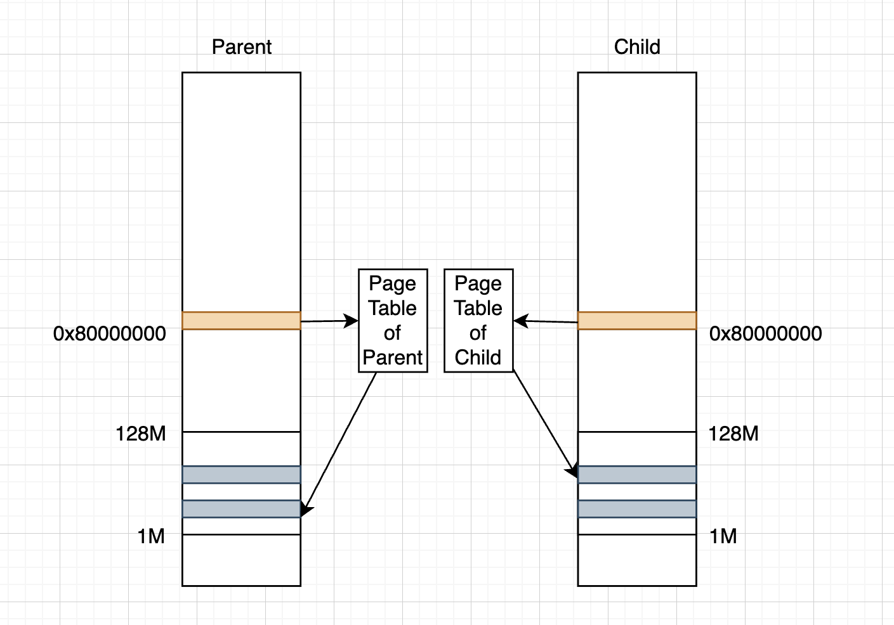
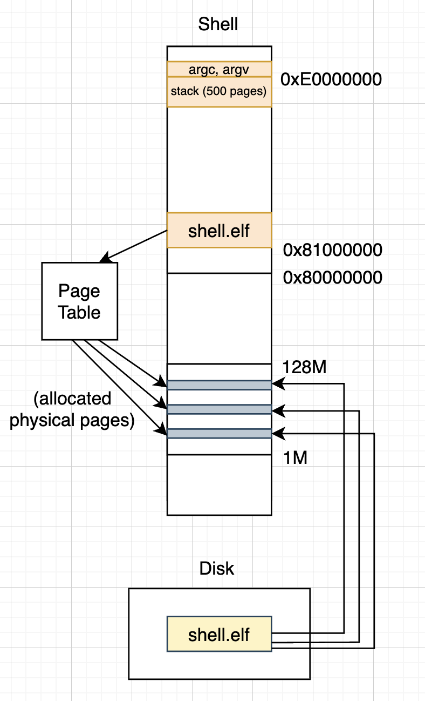

# SimpleOS

SimpleOS is an OS implementation that is used to enhance my understanding of OS concepts.

  

---

  

## Toolchain Setup

  

To build and run the OS on MacOS, you’ll need the following:

  

| Tool | Purpose |

| `qemu-system-i386` | Emulates an x86 PC |

| `CMake` | Build configuration |

| `x86_64-elf-gcc` | Cross-compiler for x86 ELF |

| `x86_64-elf-gdb` | Cross-debugger to connect to QEMU (used for remote debugging) |

| `ld`, `as`, `objcopy`, `objdump`, `readelf` | Tools for ELF analysis and binary conversion |  

| `CMake Tools` and `C/C++ Extension` | Make CMake configs and debugger setup more convenient |

  

> Installing `x86_64-elf-gcc` typically includes the full toolchain: assembler, linker, and ELF utilities.

  

---

  

## Disk Image Setup

  

### Disk 1 (Bootable)

  

- Created using `dd`

- Uses precise sector control for:

  - Boot (first 512 bytes)

  - Loader (second stage bootloader)

  - Kernel

  

### Write Script: `script/img-write-os`

  

This script automates writing contents into the disk images (using `dd`)

---

  

## Running QEMU (script/qemu-debug-osx.sh)

  

### Basic System Configuration

  

-  `qemu-system-i386`: Launches QEMU emulating a 32-bit x86 machine.

-  `-m 128M`: Allocates 128MB of memory to the virtual machine.

-  `-serial stdio`: Redirects the virtual machine's serial output to the host terminal.

- Useful for printing messages from OS.

---

  

### Attaching Disk Images

  

-  `-drive file=disk1.dmg,index=0,media=disk,format=raw`

Attaches the first virtual disk (containing the boot, loader, and kernel).

  

-  `-drive file=disk2.dmg,index=1,media=disk,format=raw`

Attaches a second virtual disk (for file system or user programs).

  

---

  

### Debug Mode

  

-  `-s`: Starts a GDB server on TCP port `1234`. Equivalent to `-gdb tcp::1234`.

-  `-S`: Pauses the CPU immediately after boot. Execution will not start until GDB sends a `continue` command.

  

> This is why the system will not automatically run bootloader when QEMU starts. You must connect with GDB and manually start execution.

  

---

  

## Debugging with GDB and VSCode

  

### Overview

  

- VSCode uses `x86_64-elf-gdb` as a cross-debugger.

- It connects to QEMU's GDB server at `localhost:1234`.

- ELF files are loaded to provide:

  - Symbol information

  - Debug info (DWARF sections) => Generated when compiled in debug mode

  

---

  

### Debugging Launch Flow

  

1. Write disk images and run QEMU.

2. Press the **Debug** button in VSCode.
   - VSCode launches `x86_64-elf-gdb` and connects to QEMU.
   - GDB pauses at `0x7C00` (bootloader entry point).
   - GDB loads ELF files and debug info using `program` and `add-symbol-file`.

3. You can now:
   - Step through source or assembly
   - Inspect memory, registers, and stack
   - Set and hit breakpoints

  

---

  

## Boot

  


  

The **Boot** code resides in the very first sector of the disk (sector 0) and is loaded by the BIOS to memory address `0x7C00` when the QEMU starts. This is the beginning of the OS boot sequence, running in **real mode (16-bit)**.

  

Since the CPU starts in real mode, the boot code uses `.code16` and `__asm__(".code16gcc")` (for c file) to tell the assembler to generate 16-bit instructions compatible with the initial CPU state.

  

The Boot stage performs two main tasks:

  

1.  **Loads the Loader from disk** 
   - The boot code uses BIOS interrupts (e.g., `INT 13h`) to read sectors from disk into memory. Specifically, it loads the "Loader" program into physical memory at address `0x8000`.

  

2.  **Jumps to the Loader** 
   - After loading, Boot uses a **function pointer** technique in C to jump to the Loader's entry point. For example:

````c

#define LOADER_START_ADDR 0x8000

  

void boot_entry(void) {

((void (*)(void))LOADER_START_ADDR)(); // jump to loader code

}
````

---

### Ends with 0x55 and 0xAA

  

The final two bytes of the boot sector must be `0x55` followed by `0xAA`. This is a **BIOS requirement** to identify a valid boot sector.

  

BIOS will:

  

- Scan devices (e.g., hard disk, USB) looking for a bootable sector.

- Read the **first 512 bytes** of each device (the boot sector).

- Check the **last two bytes** of that sector:

- If they are `0x55AA`, BIOS considers it a valid boot sector and executes it.

- If not, BIOS skips the device and tries the next one.

  

Therefore, every boot sector must explicitly reserve space for this signature, as we can see in boot/start.S :

````asm

.byte 0x55, 0xAA
````

---  

### Build System Notes

  

To ensure that the linker places the boot code at the correct physical memory address (**`0x7C00`**) and that the boot sector is exactly **512 bytes**, the following CMake configurations are used:

  

#### 1. Source Ordering

  

Place `start.S`  **first** in the source list to ensure it becomes the entry point of the final binary (**boot.elf**):

  

````cmake

file(GLOB C_LIST "*.c" "*.h")

add_executable(${PROJECT_NAME} start.S ${C_LIST})

````

  

This guarantees that the start.S (boot) code is linked first and becomes the first code to execute.

  

#### 2. Linker Address Configuration (Make Symbol Addresses Start from 0x7c00)

  

Set linker flags so that:

  

- The boot code starts at `0x7C00`, where the BIOS expects to load it.

- The `boot_end` section aligns at `0x7DFE` (just before `0x7E00`), leaving space for the `0x55AA` signature at the last two bytes.

  

````cmake

set(CMAKE_EXE_LINKER_FLAGS "-m elf_i386 -Ttext=0x7c00 --section-start boot_end=0x7dfe")

````

---

  

## Loader

  


  
  

The loader is composed of the following files:

  

-  `start.S`

-  `loader_16.c`

-  `loader_32.c`

-  `loader.h`

  

The loader is built as an ELF file, then converted into a `.bin` by post-build commands. This binary is then written to the correct disk sector by an image creation script (using `script/img-write-os`). Note that **only boot and loader** are converted into bin files.

---

### Execution Overview

  

The loader consists of two main parts:

  

-  `loader_16.c`: Runs in **real mode**, performs **memory detection** (using BIOS interrupt)

-  `loader_32.c`: Runs in **protected mode**, **enables paging**, and **loads the kernel**

  

It begins execution in 16-bit mode and switches to 32-bit protected mode after completing basic memory detection.

---

### loader_16.c (Real Mode)
  

#### 1. Show Startup Message

  

- Uses BIOS interrupt `INT 10h` to print a message to the screen

- Displays one character at a time using `INT 10h`

  

#### 2. Detect Usable Memory

  

- Calls BIOS interrupt `INT 15h`.

- Stores memory map entries into a `boot_info_t` structure

- Loops through all available entries, stopping when BIOS indicates completion

- 0 - Around 600KB, 1MB - 128MB are available memory

- Others parts of memory are reserve for video memory and BIOS

  

#### 3. Entering Protected Mode

  

The `enter_protect_mode()` function transitions the CPU from **real mode** to **protected mode**. This involves **turning off interrupts**, **enabling the A20 line**, **setting up the GDT**, **flipping the PE bit in `CR0`**, and **performing a far jump to 32-bit code**.

  

Below is the code:

  

````c

static void enter_protect_mode(void) {

// 1. Disable interrupts to prevent unexpected behavior
// during the mode switch

cli();

  

// 2. Enable the A20 line (allow addressing beyond 1MB)

// A20 address line wraparound occurs in x86 real-mode when the A20 line is disabled, 
// causing addresses above 1 MB (e.g., 0x100000) to wrap around to low memory (e.g., 0x00000)
// for 8086 compatibility (since there are only 20 address lines in 8086). 
// Enable A20 and switch to protected mode to access 1 MB–128 MB.

uint8_t v = inb(0x92);

outb(0x92, v | 0x2);

  

// 3. Load the Global Descriptor Table (GDT)
// The GDT defines memory segments for protected mode

lgdt((uint32_t)gdt_table, sizeof(gdt_table));

  

// 4. Enable protected mode
// Set the PE (Protection Enable) bit in control register CR0

uint32_t cr0 = read_cr0();

write_cr0(cr0 | (1 << 0));

  

// 5. Performs a far jump to clear the instruction pipeline
// This is necessary because enabling PE doesn't immediately switch to protected mode
// The far jump flushes the CPU pipeline and sets the new CS value
// Jump to assembly since we need to set segment registers

far_jump(8, (uint32_t)protect_mode_entry);

}

````
---
### GDT Table Definition

  

The Global Descriptor Table (GDT) is an array of **64-bit** segment descriptors used in **protected mode** to define memory segments.

  

In the loader, the GDT is defined as follows:

  

````c

uint16_t gdt_table[][4] = {

// Each descriptor is 64 bits = 4 × 16-bit words

{0, 0 , 0, 0}, // Null descriptor (mandatory)

{0xFFFF, 0x0000, 0x9A00, 0x00CF}, // Code segment: base=0x00000000, limit=0xFFFFF, DPL=0, exec/read

{0xFFFF, 0x0000, 0x9200, 0x00CF}, // Data segment: base=0x00000000, limit=0xFFFFF, DPL=0, read/write

};

````

---

### Segment Setup in Protected Mode

  

After enabling protected mode via CR0 and doing a far jump, the CPU switches to protected mode, but all **data segment registers (`ds`, `ss`, `es`, etc.) are still undefined or zero** unless explicitly initialized.

  

In `protect_mode_entry`, the goal is to initialize all relevant segment registers to use a proper **data segment descriptor** from the GDT.

  

````asm

protect_mode_entry:

// Set all data segment registers to use selector 0x10

mov $16, %ax ; 0x10 = selector for data segment in GDT (index 2 × 8)

mov %ax, %ds ; Set data segment

mov %ax, %ss ; Set stack segment

mov %ax, %es ; Extra segment (used in string ops)

mov %ax, %fs ; FS/GS available for user/kernel-specific storage

mov %ax, %gs

  

// Far jump to reload CS with 0x08 (code segment selector) and start loading kernel

jmp $8, $load_kernel ; 0x08 = code segment selector (index 1 × 8)

````

---

###  loader_32.c — Load and Start the Kernel

  

This file represents the 32-bit stage of the loader, which is entered after switching into protected mode. It is responsible for:

  

- Reading the kernel from disk

- Parsing the ELF file

- Setting up temporary paging

- Jumping to the kernel entry point

#### 1. `read_disk(sector, sector_count, buf)`

  

Reads sectors from disk into memory using **LBA mode**:

  

- This reads the kernel binary from disk sector 100 into memory at `SYS_KERNEL_LOAD_ADDR`.

  

#### 2. `reload_elf_file(file_buffer)`

  

Parses the kernel ELF file and loads each segment defined in the **Program Header Table**:

  

- Validates the ELF magic number (`0x7F 'E' 'L' 'F'`)

- Iterates through program headers

- For each `PT_LOAD` segment:

- Copies file contents from `p_offset` to `p_paddr`

- Zeroes out `.bss` using `p_memsz - p_filesz`

  

Returns the **entry point address** from the ELF header.

  

> This is how the loader finds the correct entry address, instead of assuming `0x10000` (set by kernel.lds).

  

#### 3. `enable_page_mode()`


Sets up a simple one-entry page directory that maps virtual memory directly to physical memory (**identity map**), so that loader is able to continue running:

- Uses **4MB pages**

- Sets CR3 to the aligned page directory (note that page directory is aligned to 4096)

- Enables `CR0.PG` to activate paging

  

> This is a minimal paging setup used only in the loader; the kernel will later create its own page tables, and use 4KB pages as well.

  

#### 4. `Jumps to kernel`

  

Jumps to the kernel entry point with `boot_info` as argument:

  

````c

((void (*)(boot_info_t *))kernel_entry)(&boot_info);

````

---

## Kernel

The kernel is the core component that takes over control after the loader finishes its job. It is entered in **32-bit protected mode**, and is responsible for initializing essential subsystems.

The kernel is compiled as an **ELF file** with a well-defined entry point (`_start` in `start.S`) and loaded into memory by the loader.

---

### Passing `boot_info` to `kernel_init`

The loader passes a pointer to the `boot_info_t` structure to the kernel's entry function (`_start`). This structure contains usable memory information, and we will further pass this pointer into `kernel_init` function.

At the end of loader, we do:
````c
((void (*)(boot_info_t *))kernel_entry)(&boot_info);
````

From Intel calling conventions, we know parameters (boot_info) and return address are pushed into the stack in order, so the stack looks like:

````c
↑ Higher Address

[ boot_info pointer ]
[ return address ] <- esp
````

After entering _start, we follow the conventions as well, pushing ebp register to stack,
moving esp to ebp, and we can fetch the parameter (boot_info) pushed previously:

````c
↑ Higher Address

[ boot_info pointer ]
[ return address ]
[ prev ebp ] <- current ebp/esp
````

Finally, to pass the parameter (boot_info) to `kernel_init`, we push it again to the stack so that in `kernel_init` it can fetch it using the calling conventions:

````c
↑ Higher Address

[ boot_info pointer ]
[ return address ]
[ prev ebp ] <- current ebp
[ boot_info pointer (eax) ] <- current esp
````

(Optional) In the code, it doesn't return to the caller function so we don't have to handle that part. However, following the conventions a function should clear the stack frame, which moves **esp** to **current ebp** and update ebp by popping the stack. The use of **ebp** helps clearing stack frames and localizing params.

````c
mov %ebp, %esp
pop %ebp 
````

---

### GDT Overview
The Global Descriptor Table (GDT) is a data structure used in protected mode on x86 to define memory segments and privilege levels.

Each entry in the GDT is called a segment descriptor, which tells the CPU:

What range of memory it describes (base + limit)

What kind of access is allowed (code/data, read/write)

What privilege level is required (ring 0–3)

The CPU uses **segment selectors** (like cs, ds) to index into the GDT and load the correct descriptor.
___

### GDT Initialization (`init_gdt`)
This function initializes a larger, more complete GDT table than the earlier boot-time minimal GDT. It prepares the descriptors to support separate code/data segments for kernel. Note that after loading the larger GDT, `gdt_reload` is used to **reset the cached descriptors**.

---

### (Not Used) LDT Overview


The **Local Descriptor Table (LDT)** is a per-process table that holds segment descriptors (like code and data segments) specific to a single process.

- Each process can have its own LDT to define private memory segments.
- The CPU has a special register called **LDTR**, which stores a **selector** pointing to an entry in the **GDT**.
- That GDT entry describes the **base address and size of the LDT**.

- When a segment register (like `cs`, `ds`, or `ss`) contains a **selector with the TI (Table Indicator) bit set to 1**, it tells the CPU to look up the descriptor in the **LDT**, not the GDT.

- The **selector to the LDT entry in the GDT is saved in the TSS (Task State Segment)**.

---

### Exceptions vs. Interrupts
Interrupts and exceptions are special control transfers that redirect the CPU to handle unusual conditions.

Interrupts are triggered by external, asynchronous events (e.g., keyboard input, timer tick).

Exceptions are triggered internally by the CPU during instruction execution (e.g., divide-by-zero, page fault).

**Both use the IDT to determine how to handle the event** — by jumping to the corresponding handler function defined in the IDT entry. However, the vector (number) for exceptions are usually fixed, which are defined by CPU. Vectors (numbers) for interrupts can vary on the contrary.

Handlers for both **exceptions** **(NOT defined!)** and interrupts are undefined in advance. Defining handlers by users are needed.

---

### IDT Overview

The **Interrupt Descriptor Table (IDT)** is a data structure used in x86 protected mode to define how the CPU should respond to **interrupts** and **exceptions**.

Each entry in the IDT tells the CPU:

Which **segment selector** to use (usually pointing to a code segment in the GDT).

What type of gate it is (interrupt gate, trap gate).

What privilege level (DPL) is required to trigger it.


---

### IDT Together with GDT


The **Interrupt Descriptor Table (IDT)** doesn't work in isolation — it relies on the **Global Descriptor Table (GDT)** to define what memory segment the CPU should switch to when handling an interrupt or exception.

Each **IDT entry** includes a **segment selector**, which refers to an entry in the **GDT**, typically the **kernel code segment**:

````c
gate_desc_set(..., KERNEL_SELECTOR_CS, handler_addr, ...);
// KERNEL_SELECTOR_CS = 0x08 → points to the code segment in the GDT
````
- When an interrupt or exception occurs, the CPU:

  - Looks up the handler address in the IDT

  - Loads the CS register using the segment selector from the IDT entry

  - Sets EIP to the handler’s offset

  - Switches to kernel mode (if privilege level allows)

  - Starts executing the interrupt handler

---

### Commonly Seen x86 Exceptions
| Vector | Name                      | Description                                                   |
|--------|---------------------------|---------------------------------------------------------------|
| 0      | #DE – Divide Error        | Divide by zero
| 1      | #DB – Debug               | Hardware triggered breakpoints                               |
| 3      | #BP – Breakpoint          | Triggered by int3, used for debugging                         |
| 4      | #OF – Overflow            | Detects and reports arithmetic overflows                         |
| 6      | #UD – Invalid Opcode      | CPU cannot decode the instruction                             |
| 13     | #GP – General Protection  | Generic protection violation (e.g., segment fault) |
| 14     | #PF – Page Fault          | Invalid memory access (e.g., page not present)   |


---

### Exception Handler Overview

In x86 protected mode, exception and interrupt handlers **must** end with `iret` to properly restore the CPU’s execution context (EIP, CS, EFLAGS). A C `ret` cannot do this, so handlers are written in assembly using a reusable macro:

````asm
.macro exception_handler name num with_error_code
````

---

### Macro

Generates an exception handler labeled `exception_handler_<name>` that:

1. **Saves CPU state**  
   - **Hardware-pushed** by the CPU on entry:  
     - `EIP`, `CS`, `EFLAGS`, and _optional_ `Error Code`  
   - **`pusha`** (all general-purpose registers):  
     ````
     EAX, ECX, EDX, EBX, ESP (old), EBP, ESI, EDI
     ````
   - **Manually** saved segment registers:  
     ````
     DS, ES, FS, GS
     ````

3. **Passes the saved frame to a C handler**  
   - Pushes the current `ESP` (which now points to the saved registers)  
   - Calls `do_handler_<name>(exception_frame_t *frame)`

4. **Kills process or halt**  
   - Kills if generated by process
   - Halt if generated by kernel 
5. **Restores CPU state**  
   - Cleans up the stack parameter  
   - Pops segment registers, then registers saved by `pusha`

6. **Returns with `iret`**  
   - Restores `EIP`, `CS`, and `EFLAGS`  
---

### PIC Initialization

The x86 platform uses **two cascaded 8259 PIC (Programmable Interrupt Controller) chips** to manage hardware interrupts:

- **Master PIC (PIC0)** handles IRQ 0–7  
- **Slave PIC (PIC1)** handles IRQ 8–15 and connects to IRQ2 of PIC0  

---

### Key Points from `init_pic()`

1. **Two PIC Chips Are Connected**  
   - PIC1 is connected to PIC0’s IRQ2 line  
   - This cascade setup expands the number of IRQs from 8 to 15   

2. **Interrupt Numbers Can Be Remapped**  
   - PIC0 is configured to start at interrupt vector `0x20`  
   - PIC1 is configured to start at `0x28`  
   - This avoids overlapping with CPU exception vectors (which use 0x00–0x1F)

3. **Each IRQ Line Can Be Masked or Enabled**  
   - The **IMR (Interrupt Mask Register)** is used to disable specific IRQ lines  
   - In this setup:
     - PIC0 masks all IRQs except IRQ2 (used to reach PIC1)  
     - PIC1 masks all its IRQs until drivers enable them later

````c
outb(PIC0_IMR, 0xFF & ~(1 << 2));  // Unmask only IRQ2
outb(PIC1_IMR, 0xFF);              // Mask all slave IRQs
````

---

### Controlling Interrupts in x86

Interrupts in x86 can be managed at **two levels**:


1. Each 8259 PIC provides an **Interrupt Mask Register (IMR)**  
- **Mask** (disable) an IRQ by setting its bit in the IMR  
- **Unmask** (enable) an IRQ by clearing its bit  

2. **Global Enable/Disable (EFLAGS.IF)**
- The **IF (Interrupt Flag)** in the **EFLAGS** register gates all maskable interrupts
- **cli** — Clear the IF flag → disable all maskable interrupts
- **sti** — Set the IF flag → enable all maskable interrupts

---

### PIT (Programmable Interval Timer, 8253) Configuration

- The PIT oscillator runs at `PIT_OSC_FREQ` (≈ 1.193182 MHz).
- To generate an OS tick every `OS_TICK_MS` milliseconds, compute the reload value:
    ````c
    reload_count = PIT_OSC_FREQ / (1000.0 / OS_TICK_MS);
    ````
- PIT is hardwired to **IRQ 0** (interrupt vector 0x20) on the master 8259 PIC.
- Each time the countdown reaches zero, the PIT sends an interrupt.
- The handler function is registered in /kernel/init/start.S through:
    ````c
    exception_handler timer, 0x20, 0
    ````

---

### `klib.c` Function List

The `klib.c` file provides basic kernel-level string and memory functions. It includes:

### String Functions
- `kernel_strcpy(char *dest, const char *src)`
- `kernel_strncpy(char *dest, const char *src, int n)`
- `kernel_strncmp(const char *s1, const char *s2, int n)`
- `kernel_strlen(const char *s)`

### Memory Functions
- `kernel_memcpy(void *dest, const void *src, int n)`
- `kernel_memset(void *dest, uint8_t v, int n)`
- `kernel_memcmp(const void *d1, const void *d2, int n)`

### Formatted Output & Number Conversion
- `kernel_vsprintf(char *buf, const char *fmt, va_list args)`
- `kernel_sprintf(char *buf, const char *fmt, ...)`
- `kernel_itoa(char *buf, int num, int base)`

---

### `kernel_vsprintf`: Formatted Output

This function mimics `vsprintf`, formatting a string using a format string and a `va_list` of arguments. It supports the following format specifiers:

- `%s` – string  
- `%d` – decimal integer  
- `%x` – hexadecimal integer  
- `%c` – character

The function processes the format string one character at a time. When it sees a `%`, it enters a state to parse the next format character and uses helper functions like:

- `kernel_strcpy()` and `kernel_strlen()` for `%s`
- `kernel_itoa()` for `%d` and `%x`
- direct character assignment for `%c`

No dynamic memory allocation is used; the buffer is filled directly.

---

### `kernel_itoa`: Integer to String Conversion

This function converts an integer `num` into a string representation in the given `base`. It supports bases 2, 8, 10, 16:

- If `num` is negative and base is 10, it handles the sign, otherwise use two's complement.
- Note that for negative base 10 numbers, we cannot simply do **num = -num** since there's an issue of **overflow**

___

### Task Switching with TSS


This kernel uses **TSS (Task State Segment)** to support task switching.

When switching tasks, the CPU can automatically load new values for registers (including **general, segment, esp, eip, eflags, CR3**, etc.).

During initialization, we call `tss_init()` and pass in the **entry** and **kernel stack pointer** (`esp`) for the task:

---

### How TSS Works

**Each process has its own TSS (Task State Segment)**.

Therefore, for **every process**, a corresponding **TSS descriptor is placed in the GDT**.

These descriptors let the CPU locate and use the correct TSS when performing a task switch, and the corresponding selector (`tss_sel`) is stored in the **task structure**.

Note that TSS structures **cannot be dynamically allocated (e.g., via `malloc`)**. Instead, the kernel preallocates a fixed array of TSS entries globally.

To switch between tasks, the kernel performs a **far jump (ljmp)** to the TSS selector of the target task:

````c
ljmp $selector, $0
````

This causes the CPU to load the new task's TSS, restore all saved registers from the TSS, and begin execution from the eip stored in that TSS.

---

### Task Management and List Structure

The kernel organizes tasks using a custom **doubly linked list** system. At the center of task management is the `task_manager_t` structure, which contains several different task lists.

One of the core data structures are for list management:

````c
typedef struct _list_node_t {
    struct _list_node_t *pre;
    struct _list_node_t *next;
} list_node_t;
````

Instead of storing pointers to task_t directly, the kernel **embeds a list_node_t inside task_t**. This avoids creating **list manipulating functions** every time a new data structure is introduced. That is, for every data structure to be organized as a list, we can just **embed list_node_t** in it and all list manipulating functions could be **resued** (e.g. list_insert_last, list_insert_after, etc.).

To retrieve the **containing structure pointer** (e.g. task_t*) from a list_node_t*, the following macros are used:

````c
#define offset_in_parent(parent_type, node_name) \
    ((uint32_t)&((parent_type*)0)->node_name)

#define parent_addr(parent_type, node_name, list_node_ptr) \
    ((uint32_t)list_node_ptr - offset_in_parent(parent_type, node_name))

#define parent_pointer(parent_type, node_name, list_node_ptr) \
    ((parent_type*)(list_node_ptr ? parent_addr(parent_type, node_name, list_node_ptr) : 0))
````

These macros perform pointer arithmetic to backtrack from the list node pointer to the parent structure pointer that embeds it.

___


### Task Structure (`task_t`)

The `task_t` structure represents a process in the kernel. It holds all necessary information for task scheduling, execution, and management.

### Fields

- **`state`**  
  Represents the current **lifecycle state** of the task (e.g., `TASK_CREATED`, `TASK_RUNNING`, `TASK_SLEEP`).

- **`status`**  
  Holds the **exit status** or return code of the task.  
  Useful for process termination and reporting.

- **`pid`**  
  The **process ID**, a unique identifier for this task.

- **`name[TASK_NAME_SIZE]`**  
  A character array storing the **name of the task**.

- **`parent`**  
  A pointer to the **parent task**, forming a parent-child relationship for task trees.

- **`tss`**  
  The **Task State Segment**, a hardware-supported structure for saving task context (registers, stack pointer, etc.).  
  Required for **hardware task switching**.

- **`tss_sel`**  
  The **TSS selector** in the GDT.  
  Used during `ljmp` to switch to this task.

- **`curr_tick`**  
  A **countdown timer** that decreases on every tick.  
  When it reaches 0, the scheduler then **reschedules** another task.

- **`sleep_tick`**  
  Indicates how long the task should **remain asleep**.  
  When it hits 0, the task becomes **eligible to run** again.

- **`all_node`**  
  A `list_node_t` used to link this task into the **global task list**.  
  Tracks **all tasks** in the system.

- **`run_node`**  
  Another `list_node_t`, used in queues like **ready list** or **sleep list**.  
  Helps the task move between different **scheduling states**.

___

### Task Manager: `task_manager_t`


The kernel uses the `task_manager_t` structure to organize and manage the lifecycle and state of tasks using linked lists and a current task pointer.

Key Fields in `task_manager_t`:

- **`curr_task`**:  
  A pointer to the **currently running task** on the CPU. This allows the kernel to quickly access the currrent running task.

- **`ready_list`**:  
  A list of tasks that are **ready to run**, including the current task. This is the main run queue from which the scheduler picks the next task to execute.

- **`task_list`**:  
  A comprehensive list containing **all tasks** that currently exist in the system, regardless of whether they are running, ready, or sleeping.

---

### Task Yielding (`sys_yield`, relinquishing the CPU)

When a task voluntarily gives up the CPU by a system call, the operating system performs the following steps to switch to another runnable task using sys_yield.

### Yielding Procedure

1. **Remove the Current Task from the Ready List**
   The current task is removed from the front of the ready list using the function:
   ````c
   task_set_unready(curr_task);
   ````
2. **Re-append the Task to the End of the Ready List**
    This allows the task to run again later after others have had a chance:
    ````c
    task_set_ready(curr_task);
    ````
3. **Select the Next Task to Run**
    The OS picks the **first task** in the ready list and switches context to it using:
    ````c
    task_dispatch(next_task);
    ````
---

### Round-Robin Scheduling

The kernel uses a **round-robin scheduling** strategy to ensure fair CPU time distribution among all ready tasks.

### Time Slice

- Each task is allowed to run for a **maximum of 10 ticks** (time units).
- A global timer (e.g., driven by the PIT interrupt) increments the tick count.

### Switching Tasks

- After **10 ticks**, the currently running task yields the CPU.
- The scheduler then picks the **next task** in the `ready_list` using `task_dispatch`.

This ensures that all tasks take turns using the CPU in a **first-come, first-served** manner.


---

### Protecting Shared Resources: Disabling Interrupts Safely

When multiple tasks run concurrently, shared data structures must be protected from **race conditions**.

The kernel uses **interrupt disabling** to create a critical section that ensures no context switch occurs while accessing shared resources.

**Problem with Naive Enable/Disable**

Simply using `irq_disable_global()` and `irq_enable_global()` around critical sections is unsafe:

- If interrupts are **already disabled**, calling `irq_disable_global()` then `irq_enable_global()` will incorrectly **enable** them afterward.
- This creates an inconsistency where a critical section unintentionally **re-enables interrupts** that should have remained disabled.

**Solution: Save and Restore EFLAGS**

The kernel solves this by recording the original interrupt state :

````c
irq_state_t irq_enter_protection(void) {
    irq_state_t state = read_eflags();  // Save current EFLAGS (including IF)
    irq_disable_global();               // Disable interrupts
    return state;
}
````

After the critical section, the original state is restored:
````c
void irq_leave_protection(irq_state_t state) {
    write_eflags(state);  // Restore previous EFLAGS (not just blindly enable)
}
````
This ensures that the interrupt flag (IF) is restored exactly as it was, preserving system correctness and avoiding accidental re-enabling.

---

### Task Sleeping and Idle Task

**Sleeping Tasks**

To allow tasks to pause execution temporarily, the OS provides **sleeping functionality** using:

- `sleep_list`: A list in `task_manager_t` that holds all **currently sleeping tasks**.
- `sleep_tick`: A field in each `task_t` structure that tracks how many **OS ticks** remain until the task should wake up.

**Sleep Behavior (`sys_msleep`)**

When a task sleeps:

1. It is removed from the ready list.
2. It is added to the `sleep_list`.
3. Its `sleep_tick` is set to the number of ticks it should sleep.

During each timer interrupt (e.g., PIT IRQ 0), the kernel:

- Iterates through the `sleep_list`.
- Decrements the `sleep_tick` of each task.
- When `sleep_tick` reaches 0, the task is:
  - Removed from `sleep_list`.
  - Added back to the ready list (via `task_set_ready`).

**Idle Task**

To keep the CPU occupied when there are **no runnable tasks**, the OS creates a special **idle task**:

- The idle task continuously executes the `hlt` instruction.
- This halts the CPU until the **next interrupt** (e.g., from PIT) arrives.

> The idle task is always present in the system but only runs when the ready list is empty.


---

### Semaphore


- **Initialization**  
  The semaphore is initialized with a count value representing how many tasks can proceed immediately.  
  A waiting queue is also initialized to hold blocked tasks.

- **Wait (`sem_wait`)**  
  When a task wants to proceed:
  - If count > 0 → decrement the count and allow the task to continue.
  - If count == 0 → add the task to the waiting queue and block it.

- **Notify (`sem_notify`)**  
  When a resource becomes available:
  - If the waiting queue is not empty → unblock the first task in the queue.
  - If the queue is empty → increment the count to allow future tasks to proceed.

---

### Mutex


- **Initialization**  
  The mutex is initialized in an unlocked state with no owner.  
  A waiting queue is created to hold tasks that may need to wait.  
  A `locked_count` field is set to 0 — it tracks how many times the current owner has acquired the lock (for reentrant locking).

- **Locking**  
  When a task attempts to lock the mutex:
  - If the mutex is unowned → the task becomes the owner, and `locked_count` is set to 1.
  - If the task already owns the mutex → increment `locked_count`.
  - If another task owns the mutex → the requesting task is added to the waiting queue and blocked.

- **Unlocking**  
  When the owning task releases the mutex:
  - Decrement `locked_count`.
  - If `locked_count` reaches 0 → release ownership.
    - If the waiting queue is not empty → assign ownership to the first waiting task and set its `locked_count` to 1.

---

### Memory Management Overview



Memory management utlizes two structures:

- **`bitmap_t`**  
  This structure is responsible for tracking the usage of memory blocks.  
  Each bit represents the state (used or free) of a fixed-size memory block.

- **`mem_alloc_t`**  
  This structure contains a `bitmap_t` and provides functions for allocating and freeing memory.  
  It uses the bitmap to find free blocks and manage memory allocation dynamically.

**Memory Layout of the system**:


Note that the bitmap is placed **right after the kernel**. We can do this by specifying the ending address of the kernel in **linker script**, and use it in c code.

---

### Two-Level Page Table (x86 Paging)



x86 uses a **two-level paging system** to translate virtual addresses to physical addresses:

1. **Page Directory** (Level 1):  
   - Contains 1024 entries.
   - Each entry points to a **Page Table**.
   - Each entry covers **4MB** of virtual space (1024 * 4KB).

2. **Page Table** (Level 2):  
   - Also contains 1024 entries.
   - Each entry maps to a **4KB** physical page.

So the total addressable space is:  
`1024 Page Directory Entries × 1024 Page Table Entries × 4KB = 4GB`

**Why Two-Level Page Table Saves Space**

- The **Page Directory** always exists and has 1024 entries.
- But the **Page Tables** are **only allocated when needed**.

> If a Page Directory entry is marked **invalid**, then:
> - The corresponding **Page Table is not allocated**.
> - The **4MB range** it would cover is treated as unmapped.

---

### Address Translation in x86 Systems

Modern x86 systems use **segmentation + paging** to translate memory addresses through multiple stages.


1. **Logical Address**    
    A **logical address** consists of two parts:
    - **Segment selector** (e.g., `cs`, `ds`, etc.)
    - **Offset** (the address generated by the compiler relative to section)

    Example:  
    ````text
    logical address = segment:offset (e.g., 0x08:0x1234)
    ````
    Segment selectors are **set by the OS, not the compiler**.

2. **Linear Address**   
    The linear address is obtained by looking up the segment selector in the GDT (Global Descriptor Table).   
    Adding the **base address** from the GDT descriptor to the offset **linear address = base (from GDT) + offset**   
    This address represents the location in a flat 4GB virtual address space.   

3. **Physical Address**   
    The linear address is further translated to a physical address using the paging mechanism.    
    The CPU uses page directories and page tables to map linear address → physical address    
4. **Flat Memory Model (Used in Modern OS)**    
    The base in GDT segment descriptors is **set to 0**   
    So, **logical address offset == linear address**.   
    This simplifies memory addressing, as segmentation has no visible effect.   

---

### Kernel Page Table Setup

The `create_kernel_table()` function is responsible for setting up the page table for the kernel. It is called within the `memory_init()` function, and the resulting page table is registered for system-wide use.

#### Identity Mapping
- **Definition**: The entire 128MB kernel space is identity-mapped, meaning virtual addresses equal physical addresses.
- **Importance**: Critical for kernel functionality, as the kernel relies on the page table to access memory. Without identity mapping, unmapped memory would be inaccessible.

#### Permission Management
- **Approach**: Different memory regions receive specific permissions:
  - **.text section (code)**: Read-only to protect executable code.
  - **.data, display memory, extended memory**: Writable to allow modifications.
- **Implementation**:
  - Permissions are set at the Page Table Entry (PTE) level for fine-grained control.
  - Page Directory Entries (PDE) are marked accessible and writable for simplicity.

#### Mapping Structure
The `kernel_map` array defines the memory regions to be mapped, the specified starting (e.g. s_text) and ending address (e.g. e_text) are specified in the linker script:

````c
static memory_map_t kernel_map[] = {
    {0, &s_text, 0, PTE_W},                        // Writable bootstrapping section
    {&s_text, &e_text, &s_text, 0},                // .text section: read-only
    {&s_data, (void*)MEM_EBDA_START - 1, &s_data, PTE_W}, // .data section: writable
    {(void*)CONSOLE_DISP_START, (void*)CONSOLE_DISP_END, 
     (void*)CONSOLE_DISP_START, PTE_W},           // Display memory
    {(void*)MEM_EXT_START, (void*)MEM_EXT_END - 1, 
     (void*)MEM_EXT_START, PTE_W}                 // Extended memory
};
````

- **Fields**:
  - First: Starting virtual address.
  - Second: Ending virtual address.
  - Third: Starting physical address.
  - Fourth: Permission flags (e.g., `PTE_W` for writable, `0` for read-only).

#### Key Function: `memory_create_map`
````c
int memory_create_map(pde_t *page_dir, 
                      uint32_t vstart, 
                      uint32_t pstart, 
                      int page_count, 
                      uint32_t perm);
````

#### Functionality
- **Purpose**: Configures page directory and page table entries to map virtual addresses to physical addresses.
- **Parameters**:
  - `page_dir`: Pointer to the page directory.
  - `vstart`: Starting virtual address of the range.
  - `pstart`: Starting physical address to map to.
  - `page_count`: Number of pages to map.
  - `perm`: Permission flags (e.g., `PTE_W` for writable, `0` for read-only).
- **Behavior**:
  - Fills in Page Directory Entries (PDE) and Page Table Entries (PTE).
  - Establishes a mapping from the virtual address range (`vstart`) to the physical address range (`pstart`).
  - Applies the specified permissions to the mapped pages.
  - **Note that if a page table (second-level) isn't allocated, it automatically allocates one** and fills in the mapping.

---

### User Process Page Table Creation

The following functions are used to create and configure these page tables:

#### memory_create_uvm()
Creates the initial page directory and kernel mappings for a user process (mapped kernel part, user memory remains unmapped)

- **Allocates a new page directory** for the user process.
- For kernel space, it does not create new page tables—instead:
  - **Reuses the kernel's page tables** by copying Page Directory Entries (PDEs) that point to `kernel_page_dir`.
  - This allows user processes to access kernel space (with proper permissions) without duplicating kernel mappings.

#### alloc_mem_for_task(...)
````c
int alloc_mem_for_task(uint32_t page_dir, 
                       uint32_t page_count, 
                       uint32_t vstart, 
                       uint32_t perm);
````
Allocates physical pages and maps them into the user process’s address space (for a certain page directory).

- **`page_dir`**: The page directory of the user process.
- **`page_count`**: Number of pages to allocate.
- **`vstart`**: Starting virtual address where the memory should be mapped.
- **`perm`**: Page permissions (e.g., user-accessible, writable).

#### Note
- For user code, the virtual address should be above `0x80000000`, separating user space from kernel space.
- Each mapping fills in corresponding page directory and page table entries with physical pages allocated for the user.
- Kernel code/data and user code/data are separated so that they don't interfere each other and we can set different permissions for each one.
- Note that the system call `execve` uses this many times since **it has to allocate memory for the new program, and allocation for stack space is need as well.**

#### memory_copy_uvm(...)
The `memory_copy_uvm` function is used to **duplicate a user process's memory space**. Specifically, it:

- Creates and returns a **new page directory**
- Sets up virtual addresses in the new page directory to match those in the original `page_dir`
- For each mapped page:
  - Allocates new **physical memory**
  - **Copies the content** from the original physical page into the newly allocated one

In effect, the **virtual address mappings are identical**, but each virtual address points to a **separate copy of the physical memory**, not shared with the original. This is essential for process isolation (e.g., in `fork()` system calls).

#### memory_copy_uvm_data(...)
````c
int memory_copy_uvm_data(uint32_t to, uint32_t page_dir, uint32_t from, uint32_t size);
````
This function copies data from the current process's virtual memory (`from`) to a target virtual address (`to`) in another address space defined by `page_dir`.

- The destination address (`to`) is a virtual address in the target address space, so we must first **translate it to a physical address** using the given page directory.
- Since **physical memory pages may not be continuous**, we cannot assume a continuous memory block — so the copy must be performed in chunks of one page at a time.
- For each page:
   - Translate `to` to its physical address using the page table.
   - Translate `from` to its physical address (in current address space).
   - Copy one page or less (whichever size remains).
   - Repeat until all `size` bytes are copied.
- Note that This function is used during `execve` to copy exec arguments to created user space.

---

### Main Task Overview

The **Main Task** serves as the **initial user process** that runs after entering the kernel.

- **Compiled with Kernel**  
  - The main task is **linked and built** together with the kernel code.  
  - It locates **right after the kernel**, which is controlled by the linker script.

- **First Running Task**  
  - During system initialization:
    - Setup the task structure, including **code entry and esp**.  
    - The **main task is assigned as the current task**.
    - The **tr (Task Register)** of the CPU is set to the corresponding number of gdt descriptor, which points to the TSS structure.
    - The **page table** (`cr3` register) is also set to use the **main task’s page directory**, which points to the kernel's identity-mapped space.
    - Allocate 10 pages (other sizes are fine) for main task, and copy the **text and data sections** to user memory space. **Note that the space allocated is larger than the size copied so the remaning spaces are for stack.**
  - After initialization it jumps to code of main task (main_task_entry), which requires privilege-level switching. This is explained in a later note section.
---


### Separating Kernel and Main Task with Linker Script

To separate the **kernel** and the **main task**, a custom linker script is used. This allows assigning different **virtual** and **physical** addresses for main task. In kernel.lds:

````ld
. = 0x80000000;

PROVIDE(s_main_task = LOADADDR(.main_task));
.main_task : AT(e_data) {
    *main_task_entry*(.text .rodata .bss .data)
    *main_task*(.text .rodata .bss .data)
    *lib_syscall*(.text .rodata .bss .data)
}
PROVIDE(e_main_task = LOADADDR(.main_task) + SIZEOF(.main_task));
````

#### Explanation
- . = 0x80000000
This sets the virtual address (link-time address) of the .main_task section to start at 0x80000000.

- AT(e_data)
This sets the physical load address for the .main_task section. The e_data symbol typically marks the end of kernel data, so .main_task will be loaded just after that in physical memory.

- LOADADDR(.main_task)
This gets the physical load address for the section.

#### Purpose
This setup makes the main task's virtual address start at 0x80000000, placing it in the user space region.

The main task code and data are linked separately from the kernel but **included in the same binary**.

At runtime, the OS will:

Allocate user memory starting from 0x80000000 (currently allocating **10 pages**).

**Copy the code/data** from the kernel area (physical memory) to the corresponding virtual address space of the user process.

#### Physical Memory Layout:  


#### Process Memory Layout:


---

### Notes on Exception Handling and Privilege Level Switching

- User processes typically run at **privilege level 3 (CPL = 3)**.
- The kernel code run at **privilege level 0**.

#### Privilege Switching on Exceptions
- When an **exception occurs** (e.g., divide error), the CPU:
  - Looks up the handler in the **IDT**.
  - **Ignores the DPL** in the IDT descriptor for exceptions (because the CPU triggered it, not software).
  - **Switches to a lower privilege level (usually 0, depending on DPL in GDT descriptor)** if needed.
  - Uses **SS0 and ESP0** from the **TSS** to switch to the kernel stack, therefore we need to setup different stack for priviledge level 0 and priviledge level 3.

#### IDT Descriptor DPL Behavior
- The **DPL in the IDT descriptor** is only used to control **which privilege levels are allowed to use `int X` software interrupts**.
- For example, `int 0x80` must have DPL = 3 to be callable from user space.
- For **exceptions like divide-by-zero**, the DPL is **not checked**.

#### Stack Switching and SS/ESP Pushing
- If a **privilege level change occurs**, the CPU:
  - Switches to the kernel stack (SS0, ESP0 from TSS).
  - **Pushes the user SS and ESP** onto the kernel stack, so that ss and esp can later be recovered.
- If **no privilege level change occurs**, the CPU:
  - Continues using the current stack.
  - **Does not push SS and ESP**, since it's already in the correct stack space.

#### Before Lowering User Process Priviledge Level
- Earlier we do not separate different priviledge levels, therefore user code runs at **privilege level 0**.
- All segments (code/data/stack) use GDT descriptors with **DPL = 0**.
- When an exception occurs:
  - No privilege switch is needed.
  - The CPU continues using the current stack.
  - **SS and ESP are not pushed (since using the same stack)** during the exception.

---

### Switching from Kernel (Privilege Level 0) to User Process (Privilege Level 3)


To transfer control from the kernel to a **user process running at privilege level 3**, we simulate an exception return using the `iret` instruction.


#### Key Steps for Privilege Level Switch

1. **Manually Push the Return Context onto the Kernel Stack**  
   In kernel mode (CPL = 0), we prepare the CPU to switch to user mode by pushing the following values:

   ````assembly
   push $user_ss      ; Segment selector for user data (DPL=3)
   push $user_esp     ; Stack pointer for user mode
   push $eflags       ; EFLAGS register
   push $user_cs      ; Segment selector for user code (CPL=3)
   push $user_eip     ; Entry point of user process
   ````

2. **Execute iret Instruction**
The iret pops the values off the stack in the following order:

EIP → sets the instruction pointer  
CS → sets the code segment and privilege level  
EFLAGS → restores flags  

**(If privilege level change is detected)** it also pops:  
ESP → sets the user-mode stack pointer  
SS → sets the user-mode stack segment  


---

### Separate Stacks for Different Privilege Levels


#### Why Two Stacks Are Required

When switching between privilege levels (e.g., from **kernel mode (CPL 0)** to **user mode (CPL 3)**), the CPU requires separate stacks for each level to ensure **memory protection** and **context isolation**.

Therefore, we must create and manage **two separate stacks** for each process:

#### 1. **User Mode Stack (CPL = 3)**

- This stack is used **when the process runs in user mode**.
- The stack pointer (`ESP`) must be set to the **top of the allocated user space**.
- We allocate **10 pages** (each 4 KB) for the user process code and data:
  - The **user stack starts at the very top** of those 10 pages.
  - Example:
    ```c
    user_esp = USER_PROCESS_BASE + 10 * PAGE_SIZE;
    ```

#### 2. **Kernel Mode Stack (CPL = 0)**

- When the CPU switches to kernel mode (e.g., due to system calls or exceptions), it **automatically uses the kernel stack**.
- This stack is typically:
  - **One page (4 KB)** in size
  - Located in **kernel space**
  - Set in the **TSS (Task State Segment)** fields `ESP0` and `SS0`

---

### How System Calls Work with Call Gates


System calls allow user-level processes (CPL = 3) to request services from the kernel. My implementation of system calls is via **call gates** defined in the **GDT (Global Descriptor Table)**.

#### 1. **Call Gate Descriptor in GDT**

- A **call gate** is a special GDT descriptor that allows **controlled privilege level transition**.
- The call gate stores:
  - The **segment selector** of the target kernel code (typically kernel code segment).
  - The **offset** of the kernel handler function.
  - The **DPL (Descriptor Privilege Level)** of the call gate.
  - The number of parameters for the system call.

#### 2. **Invoking a System Call from User Process**

- To trigger the system call:
  ````assembly
  lcall far [selector]  ; selector must point to the call gate descriptor
  ````
- RPL (Requested Privilege Level) of the selector must be 3 because the calling process is running at CPL = 3 (RPL >= CPL).
  - CPU checks max(CPL, RPL) <= DPL of the call gate.
  - So if DPL = 3, and CPL = RPL = 3 → pass.
  - If DPL < max(CPL, RPL) → the call is rejected.

- The target handler itself is located in kernel space, which has privilege level 0.

- The CPU performs the privilege transition, loading the new CS, EIP, SS, and ESP based on the **kernel-mode TSS settings**.

#### 3. Summary of Privilege Checks


---

### System Call Handling After `lcall`


1. **Privilege Level Switch**  
   When `lcall` is executed, the CPU switches from **privilege level 3 to 0** (since switch-to segment is in level 0), using the stack info from the TSS:
   - It switches to the **level 0 stack**
   - Pushes the **previous `SS` and `ESP`** onto the new stack

2. **Parameter Transfer**  
   The CPU then:
   - Copies the number of parameters (specified in the **call gate descriptor**) from the **level 3 stack** to the **level 0 stack**
   - Pushes **`CS` and `EIP`** to transfer control

3. **Extra Register Preservation**  
   In the system call handler (written in assembly), we:
   - Push general-purpose registers (`EAX`, `EBX`, etc.)
   - Push segment registers (`DS`, `ES`, `FS`, `GS`)
   - This mirrors what we do for exception handling, ensuring registers can be restored after the syscall

4. **Shared Call Gate**  
   - Only **one call gate** is used for all system calls to conserve GDT entries
   - The syscall handler uses one of the passed parameters to determine the actual function

5. **System Call Workflow**  
   The full system call sequence:
   - User pushes syscall parameters onto stack
   - Executes `lcall` with a selector referencing the call gate
   - CPU performs privilege switch and parameter copying
   - Kernel syscall handler:
     - Retrieves the syscall ID from parameters
     - Uses it to index into `sys_table` and invoke the correct function pointer

6. **Parameter Order Detail**  
   - The number of parameters copied by CPU ≠ number of arguments needed by the actual system call (e.g. we use five arguments but msleep needs only one). 
   - That’s okay: the parameters are pushed to stack in **reverse order**, that is, the needed arguments are at the **bottom** of the stack. The syscall function can still read them correctly using ebp.

---

### Fork Implementation

The `fork` system call creates a new process by duplicating the calling (parent) process.



#### 1. **Register Context Copying**

- During a system call, the CPU switches to **ring 0** and stores the user registers on the kernel (ring 0) stack.
- To fork a process, the kernel **copies the saved register context** from the parent’s kernel stack to the **child’s TSS**.

#### 2. **Memory Duplication**

- Each process must have its **own memory space**.
- The kernel:
  - **Creates a new page table** for the child process.
  - **Copies the memory content** from the parent process to the child’s memory region.
  - Ensures both processes are now **fully isolated**, despite having identical memory contents after the fork.

#### 3. **Handling Return Values**

- According to the POSIX standard:
  - The **child process** receives a return value of `0` from `fork`.
  - The **parent process** receives the **PID of the child**.
- To achieve this:
  - The kernel **sets `EAX = 0`** in the **TSS of the child** before it runs.
  - The **`do_syscall_handler`** writes the child’s PID to `EAX` for the **parent process** right before returning to user mode.

---

### `execve` Implementation

The `execve` system call is used to **replace the current process image** with a new executable (typically an ELF file). Here’s how it works step by step:



#### 1. ELF Loading and Page Table Setup

- The ELF file is parsed to **extract its program segments** (elf loaded from disk to a chunk of global memory first).
- A **new page table** is created for the process. When a loadable segment is found, we map the vaddr (specified in phdr) with the newly allocated physical memory, and then fill it using the program segment.
- Note that if we need to **access a page pointed by another page directory**, **we can't simply use a user-space virtual address to access it**. Instead, we have to find its corresponding physical page first, using the target page directory. 

#### 2. Register Initialization (Modification is in stack, not in TSS!)

- All CPU registers are cleared (set to `0`) except:
  - `EIP` is set to the ELF **entry point**.
  - `ESP` is set to the top of the user stack **minus space for syscall parameters**:
    ```c
    ESP = stack_top - sizeof(uint32_t) * SYSCALL_PARAM_COUNT
    ```
  - This is required because when returning from a system call to ring 3 (via `iret`), the CPU automatically moves the stack pointer by this amount.

#### 3. Passing Arguments (`argc`, `argv`) to the New Program

- To support `cstart(int argc, char **argv)`, we pre-fill the stack with:
  - A dummy **return address** (just to satisfy calling convention)
  - The **argument count** `argc`
  - The **argument vector** `argv`
- This way, when `cstart()` begins executing, it can retrieve the passed-in arguments directly from the stack.

#### 4. Filling the stack

- Utilizes `memory_copy_uvm(...)` to copy the argments to the location right beyond the stack.
- Note that argv[0], argv[1], etc. does not use `memory_copy_uvm(...)`. We just find the physical address and copy it directly.

---

### About `lib_syscall.c` and `lib_syscall.h`

- `lib_syscall.h` contains only the **declarations** of system calls.
  - It is **included in user programs** to allow calls like `msleep(...)`, `fork()`, etc.

- `lib_syscall.c` contains the **definitions** of the system calls.
  - These are **user-space stubs** that prepare arguments and invoke `lcall` to enter kernel space.
  - This file does **not contain the actual kernel implementation** — only the user-side syscall interface.

- `lib_syscall` is **compiled separately** and can be **linked with any user program** that needs it.
  - This avoids duplicating syscall code in every user program.

- To properly link this library into the user address space:
  - The **linker script must place its code** at a virtual address **above `0x80000000`**.
  - This ensures correct memory mapping in user space.

---

### Bss for Shell Program

- In the `load_phdr` function (used during ELF loading), we **do not perform `.bss` zeroing**.
  - This is because we are loading the ELF into a **different page directory** (the new user process).
  - Zeroing `.bss` here would require **translating virtual addresses to physical addresses** in that target address space, which is nontrivial and not the goal of `load_phdr`.

- Instead, **`.bss` is cleared later in `cstart`**, the entry point of the user program.
  - Since `cstart` runs in the **user context**, it has access to the correct page table and virtual address space.
  - Easier to do zeroing.

---

### Newlib and sbrk(int inc)


  - Note that we link newlib with **shell program** so that in shell we can utilize the c library functions.
  - In kernel, we only link lib_syscall since main task uses system calls only. Note that main task never goes to cstart function. Only child processes (shell programs) goes through cstart (also starting point).
  - sbrk is needed while using newlib. `sys_sbrk` returns the **end of the heap before sbrk**, and allocates pages for the requested new space.
  - Note that heap memory management is managed by userspace program (malloc(), free()). Kernel's reponsibility is to tell user program where the end of the heap is, and allocates required memory for it.

---

### Advantages of I/O Buffering
  - Reduce the number of I/O operations.
  - Processes don't block while doing I/O (Only if buffer size is large enough).

---

### Console and Keyboard

  - The main interface for interacting with the **output device** (`console_t`) is `console_write(...)`. This function handles writing text to the screen.
  - The main function for handling **input from the keyboard** is do_handler_kbd(...). This is an **interrupt handler** function triggered by the keyboard interrupt.

---

### Combining Console and Keyboard into TTY

1. **Combining Console and Keyboard**

   - The console device handles **output only**, and the keyboard device handles **input only**.
   - To support both input and output in one logical unit, we **combine** them into a **TTY (Teletypewriter)** abstraction.
   - A TTY is treated as a **device** that provides both **input and output** capabilities.

2. **Buffered I/O and Producer-Consumer Problem**

   - We adopt **buffered I/O** by placing **FIFOs (queues)** between producers and consumers:
     - **Input FIFO** for keyboard to TTY read.
     - **Output FIFO** for TTY write to console.
   - Benefits:
     - **Fewer I/O operations**.
     - **Non-blocking** behavior for user programs.
   - This is a **producer-consumer problem**, requiring **two semaphores**:
     - One for tracking **available data**.
     - One for tracking **available space**.
   - For **input**, the **interrupt handler** triggers when data is available (keyboard key pressed), so there is **no busy-wait**, and there's **no need for semaphore** inside the handler.

3. **`tty_open` Initialization**
   - Initializes:
     - Input and output **FIFOs**.
     - **Semaphores** for synchronization.
     - Underlying **console** and **keyboard** devices.

4. **`tty_write` Logic**
   - Typically:
     - Data is put into the **output FIFO**.
     - Hardware is triggered to **raise an interrupt** to consume the data.
   - However:
     - Our **console does not support interrupts**.
     - So, `tty_write` directly **writes to the console** instead.

5. **`tty_read` Logic**
   - Reads data from the **input FIFO**.
   - The **input FIFO** is populated by the **keyboard interrupt handler**: `do_handler_kbd`.
   - Reading ends when:
     - A **newline character (`\n`)** is received, or
     - The **requested byte count** is reached.

6. **Why Two Semaphores Are Needed**
   - One semaphore tracks the **number of items** in the buffer (to prevent underflow).
   - One semaphore tracks the **free space** (to prevent overflow).
   - This ensures correct blocking behavior **without busy-waiting** in user programs.

---

### Benefits of Device Abstraction Layer in OS Design

#### Without Device Abstraction
- For external interfaces (e.g., a generic `open()` function):
  - You would have to explicitly check **what type of device** it is (e.g., console, disk, etc.).
  - Then, call the corresponding function manually like `console_open()` or `disk_open()`.
- This leads to:
  - Repetitive and bloated code.
  - Code coupling — external logic needs to know device-specific details.
  - Repetitive parameter passing across multiple layers (`open()`, `read()`, etc.).

#### With Device Abstraction Using `device_t` and `dev_desc_t`
- `dev_desc_t`: Represents a **category of devices** (e.g., console, disk).
  - Stores function pointers: `open`, `read`, `write`, `close`, etc.
  - Shared among all instances of the same device type.
- `device_t`: Represents a **specific device instance**.
  - Stores pointer to `dev_desc_t`, device `minor`, mode, open count, and internal `data`.

#### Benefits

1. **Cleaner External Interfaces**

   - External code just calls `dev_open(device_index)` and gets a device number.
   - To read: call `dev_read(dev_num, ...)`.  
     → No need to re-pass device-specific info.

2. **Minimal Duplication in `read()`/`write()`**

   - Because function pointers are **already set during `open()`**, reading or writing becomes:

     ```c
     dev->read(dev, ...);
     dev->write(dev, ...);
     ```

   - No need for `if-else` or `switch-case` in `read()`/`write()`.

3. **`dev_open()` Is the Only Place with Device Type Checks**

   - It installs correct function pointers for each device type.
   - After that, the rest of the system doesn’t need to care (no need to do if/else checking).

4. **Enable to Store in a Device Array**

   - All devices can be stored **in a single array**.
   - External code can access them by an `dev_num`.
   - This is only possible because of abstraction.

#### Summary
- This greatly reduces **code coupling**, **redundancy**, and **maintenance burden**.

---

## Additional Notes

1. **`targetArchitecture` in `launch.json`**
   - The `"targetArchitecture": "x86"` field is used by **VSCode’s debugging frontend**, **not the actual debugger**.

2. **Host-Installed Toolchain**
   - All build and debug tools (such as **CMake**, the **cross-compiler**, and **GDB**) are installed on the **host system** (e.g., macOS).
   - These tools are **not** installed or run inside the **QEMU virtual machine**.

3. **ELF and Binary Formats**
   - Object files (`.o`) and output files like `.elf` are in **ELF (Executable and Linkable Format)** on Linux.
   - If a raw binary is needed (e.g., for bootloaders), tools like `objcopy` can convert ELF to `.bin` format.

4. **`objdump` Tool**
   - `objdump` is used to **disassemble ELF files** and inspect them in a **human-readable format**.

5. **CMake Tools**
   - CMake Tools helps define:
     - Which **compiler** to use (e.g., `x86_64-elf-gcc`)
     - What **build type** to use (`Debug`, `Release`, etc.)
   - When "build" button is pressed, the tool goes through a sequence of processes and eventually generates the executable file.
   - Alternatively, this configuration can be done using **command-line options** when compiling manually.

6. **Purpose of `launch.json` Configuration**
   - The `launch.json` file in VSCode is primarily used to configure the **debugger**.
   - It sets up:
     - The **target program** to debug (e.g., `boot.elf`)
     - The **GDB server address** (e.g., `127.0.0.1:1234`) to connect to QEMU or another remote target
     - **Symbol files** to be loaded (via `-file-symbol-file` or `add-symbol-file`)

   - Loading symbol files allows:
     - Displaying **function names** and **variable names** during debugging
     - Setting **breakpoints** by function name (e.g., `main`)
     - Printing **variable values** by name (e.g., `print my_variable`)

7. **How a debugger works (from ChatGPT)**
   - GDB uses **`fork()` + `execve()` + `ptrace()`** to debug a program.
   - `ptrace()` lets GDB control and observe it.

   - **GDB calls `fork()`**
     - Child: runs the target program.
     - Parent: stays as GDB.

   - **Child (debuggee)**
     - Calls `ptrace(PTRACE_TRACEME)` → tells the kernel it wants to be traced.
     - Calls `execve()` → replaces itself with the target binary (e.g., `a.out`).

   - **Parent (GDB)**
     - Uses `waitpid()` to wait for the child to stop.
     - Uses `ptrace()` to:
       - Read/write memory.
       - Set breakpoints (e.g., insert `0xCC`).
       - Step through instructions (`PTRACE_SINGLESTEP`).
       - Get/set register values.

8. **Why a cross debugger is needed**
   - Although GDB provides the `set architecture` command to change the target architecture at runtime, this command only works **within the range of architectures that the GDB binary was built to support**.
   - For example:
     - `x86_64-elf-gdb` may allow switching between variants like `i386` and `i8086`, but it **cannot** switch to architectures like **ARM** or **RISC-V**.
     - To debug a completely different architecture (like ARM or RISC-V), you need a GDB that was built specifically for that architecture (e.g., `arm-none-eabi-gdb`, `riscv64-unknown-elf-gdb`).

9. **Why Does the A20 Gate Exist?**
   - In the original 8086 architecture, the CPU had a **20-bit address bus**, which meant it could address up to **1 MB (2²⁰ bytes)**. If a program accessed memory beyond 1 MB (like at address `0xFFFF:0x0010` = `0x100000`), the address would **wrap around to 0x00000**, due to physical limitations.
   - However, later CPUs (like the 80286 and above) had **address buses wider than 20 bits** (e.g., 24-bit, 32-bit), so addresses past 1 MB would no longer automatically wrap — they would access actual memory beyond 1 MB.
   - To maintain **backward compatibility** with software that relied on this wrapping behavior, the **A20 gate** was introduced. It controls the **21st address line (A20)**:
     - When **A20 is disabled**, addresses wrap around at 1 MB (just like 8086).
     - When **A20 is enabled**, addresses beyond 1 MB behave normally, allowing access to extended memory.
   - This gate acts like a **switch** to turn wraparound **on or off**, depending on whether the CPU is in real mode (compatibility) or protected mode (advanced features).

10. **Why does GDT descriptor need to specify it's a code/data segment?**
   - Some bits represent different meanings for code and data segments, and priviledge level checking has different rules for code/data as well.

11. **Why does code segment descriptor has a readable bit? How can it be non-readable?**
   - "Execution (instruction fetches) from a code segment is always allowed when the segment is executable, regardless of the value of the readable bit." => from the manual
   - It prevents mov instructions that try to read from the non-readable code segments.
   

12. **Gates in x86 Protected Mode**
   - **Gates**, as the name implies, are mechanisms that allow controlled transitions between different **privilege levels** in x86 protected mode.
   - Currently, I use two types of gates:
     - **Call Gate** — defined in the **GDT**, used for switching to a higher-privileged code segment via "far call".
     - **Interrupt Gate** — defined in the **IDT**, used for handling interrupts and exceptions.
   - DPL Behavior:
     - The **Descriptor Privilege Level (DPL)** in the IDT specifies the **minimum privilege level required** for **software to invoke** the interrupt via `int N`.
     - However, **hardware-triggered exceptions or interrupts** **bypass the DPL check** entirely. 
   - After passing through a gate, the **CPU switches to the privilege level of the target code segment** defined in the gate descriptor.

13. **Features of 80386**
   - Protected mode, segmentation, paging, priviledge levels available

14. **TSS ss0, esp0 always remain static**
   - When process works in ring 0 and a context switch occurs, current ss and esp are saved into tss.ss and tss.esp instead of tss.ss0 and tss.esp0.
   - Therefore, ss0 and esp0 are never changed.

15. **Notes About ELF Files**
   - In general, **function calls cannot directly occur between different ELF files** unless they are **linked together**.
   - **Manual Jumping**: You can **jump to a specific memory address** (e.g., via function pointers or inline assembly) if you know where another program or function resides in memory.
   - **Using `execve`**: The `execve` system call **replaces the current process image** with a new program (another ELF file). This is not a function call but rather a full program switch — the current process becomes a new one.

16. **System Calls Code in Userspace**
   - All **code executed before the `lcall` instruction** in a system call invocation belongs to **userspace**.

17. **Running ./a.out on command line**
   - It is doing fork and exec behind.
   - When a c file is compiled, **it is usually linked with a c startup routine**. The c startup routine typically does initialization (e.g. zeroing bss) and execute exit() at the end.

18. **Outputting Messages**
   - Before entering protected mode, **loader** (loader_16.c) uses **BIOS interrupt** to write to video memory.
   - After entering protected mode, we utilize serial port to output to **host terminal** (since we link qemu serial with host terminal using qemu command).
   - Eventually, to output messages in **qemu terminal**, the kernel directly writes to video memory (starting from 0xb800 with 32KB in size). Cursor positions are modified and retrieved by CRT controller, which is one of the peripherals.

19. **Peripherals**
   - Devices aren't RAM and not on CPU. Communication is done by using I/O ports or memory-mapped I/O.

---

## C Language Skills

1. To get offset within a page, instead of using mod operation, we can use:
````c
uint32_t offset = task->heap_end & (MEM_PAGE_SIZE - 1);
````
2. Encapsulation in C
   - Separate **interface** (`.h`) and **implementation** (`.c`) files.
   - ~~Hide internal data/functions by defining them as `static` in the `.c` file.~~
   (Static is not needed! obj->attr doesn't work already since compiler needs the **definition** to compile into an .o file.)
   - Example:
````c
/* point.h */
struct Point;
struct Point* makePoint(double x, double y);
double getDistance(struct Point *p1, struct Point *p2);

/* point.c */
#include "point.h"
#include <stdlib.h>
#include <math.h>

struct Point {
    double x, y;
}

struct Point* makePoint(double x, double y) {
    struct Point* p = malloc(sizeof(struct Point));
    p->x = x;
    p->y = y;
    return p;
}

double getDistance(struct Point* p1, struct Point *p2) {
    double dx = p1->x - p2->x;
    double dy = p1->y - p2->y;
    return sqrt(dx*dx + dy*dy);
}
````

3. Inheritance in C
   - Achieved through **struct composition**.
   - A "child" struct embeds the fields of the "parent" **as its first member**.
   - Embedding child as the first member enables using (parent *)child as an argument to pass into methods for the parent.
   - Otherwise child->parent is neeeded. But accessing the details is not guaranteed to work. (due to encapsulation)

  ````c
  /* labeledPoint.h */
  struct LabeledPoint;
  struct LabeledPoint* makeLabeledPoint(double x, double y, char* label);

  void setLabel(struct LabeledPoint *lp, char *label);
  char* getLabel(struct LabeledPoint *lp);

  /* labeledPoint.c */
  #include "labeledPoint.h"
  #include <stdlib.h>

  struct LabeledPoint {
      double x, y;
      char* name;
  };

  struct LabeledPoint* makeLabeledPoint(double x, double y, char* label) {
      struct LabeledPoint* p = malloc(sizeof(struct LabeledPoint));
      p->x = x;
      p->y = y;
      p->name = name;
      return p;
  }

  void setLabel(struct LabeledPoint* lp) {
      lp->name = name;
  }

  char* getLabel(struct LabeledPoint* lp) {
      return lp->name;
  }

  /* main.c */
  #include "point.h"
  #include "labeledPoint.h"
  #include <stdio.h>

  int main(int argc, char** argv) {
      struct LabeledPoint* origin = makeLabeledPoint(0.0, 0.0, "origin");
      struct LabeledPoint* lowerLeft = makeLabeledPoint(-1.0, -1.0, "lowerLeft");
      printf("distance = %f\n", getDistance(
          (struct Point*) origin, (struct Point*) lowerLeft));
  }
  ````

4. Polymorphism in C
   - Without polymorphism, when implementing functions like `open_device()`, you would need to use `if-else` or `switch` statements to check the device type and then call the corresponding `xxx_open()` function:
    ````c
    if (device_type == UART) {
        uart_open();
    } else if (device_type == DISK) {
        disk_open();
    }
    ````
   - With polymorphism (via function pointers in a common abstract type like device_t), you can store all devices in a **single array** of device_t* and **simply call dev->open()** without knowing the specific type. This reduces coupling between components.
   - Inheritance focuses on code reuse (automatically acquires the same functions and attributes) while polymorphism focuses on same function name but different usage.

5. Retrieve Object Pointer from Embedded Node Pointer
   - The first way and also an easier way is to embed the node pointer as the first field of the object. We could simply do pointer conversion to get the object pointer:
    ````c
    obj_ptr = (obj_t *)node_ptr;
    ````
   - Another way is when `node` doesn't locate at the first field, we do:
    ````c
    // having outmost parentheses is safer
    #define offset(node_name, obj_type) ((uint32_t)&(((obj_type *)0)->node_name))

    #define _get_obj_ptr(node_name, obj_type, node_ptr) \
    ((obj_type *)(((uint32_t)node_ptr - offset(node_name, obj_type))))

    #define get_obj_ptr(node_name, obj_type, node_ptr) \
    (node_ptr ? _get_obj_ptr(node_name, obj_type, node_ptr) : (obj_type *)0)
    ````
